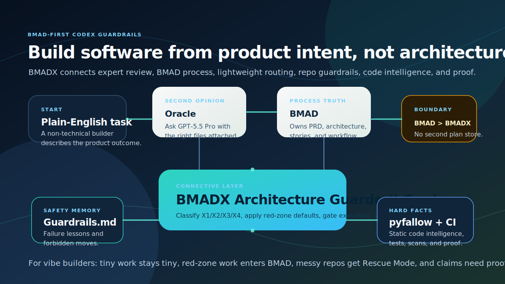

# BMADX

[](https://github.com/pdurlej/BMADX/releases/latest)
[](LICENSE)
[](docs/5-minute-quickstart.md)
[](docs/why-bmad-is-required.md)
[](START_HERE.md)

BMADX gives Codex a lightweight decision layer on top of BMAD. Instead of making
you think about process weight on every task, it picks the lightest safe mode:
tiny fixes stay tiny, normal changes stay compact, BMAD-heavy work escalates
when it should, and messy repos can drop into a rare Rescue Mode
(`X4/FUBAR`) with a scaffold bundle.

BMADX `v0.2.4` is tuned for Codex on GPT-5.5. Stronger models reduce the need
for prompt scaffolding, but they make explicit boundaries and verification more
important: BMAD still owns process, BMADX keeps the work mode light and safe.



BMADX is:
- BMAD-first
- lighter than OMX
- focused on low-friction day-to-day Codex work
- opinionated about verification and escalation

BMADX is not:
- a replacement for BMAD
- a second process system
- a clone of the `.omx` runtime

Current public version: `v0.2.4`

## Start here

If this is your first time:

1. Read [START_HERE.md](START_HERE.md)
2. Run the install wrapper from [5-Minute Quickstart](docs/5-minute-quickstart.md)
3. Paste one of the prompts from [What to Paste into Codex](docs/what-to-paste-into-codex.md)

## Who this is for

BMADX is for:
- founders, makers, designers, and PM-ish users who already use Codex
- engineers who want more discipline than ad-hoc prompting
- people who want BMAD behind the scenes without running full BMAD ceremony on every bounded task
- teams that occasionally need a rescue/scaffold layer for messy repos

BMADX is probably not for you if:
- you already know you want to work directly in BMAD all the time
- you want a durable orchestration runtime with `.omx`-style state and runtime tooling
- you only need plain Codex for trivial one-off prompts

## 5 minute quickstart

Prerequisite: BMAD must already be installed in your Codex skills. BMADX depends
on `bmad-method-codex`.

```bash
git clone https://github.com/pdurlej/BMADX.git
cd BMADX
python3 scripts/install_and_verify_bmadx.py --force
```

Then open Codex in your project and paste:

```text
Use BMADX for this repo. Pick the lightest safe mode. Keep it lightweight unless BMAD is truly needed.

My task:
<describe the change in plain English>

What I care about:
<speed / clarity / safety / cleanup / shipping>
```

More onboarding:
- [5-Minute Quickstart](docs/5-minute-quickstart.md)
- [Install for Vibe Coders](docs/install-for-vibe-coders.md)
- [What to Paste into Codex](docs/what-to-paste-into-codex.md)

## What happens after install

Most users should not choose `X1/X2/X3/X4` manually.

The intended model is:
1. describe the task in plain language
2. let BMADX classify it
3. let BMADX stay compact for normal work
4. escalate to BMAD-heavy work only when the task genuinely needs it

The internal gear model is:
- `X1` for tiny local fixes
- `X2` for normal bounded changes
- `X3` for BMAD-heavy work
- `X4` for Rescue Mode (`X4/FUBAR`) when the repo or rollout needs extra structure

`X4` is intentionally rare. It is the ace in the sleeve, not the default.

## BMAD vs BMADX vs OMX vs plain Codex

| Use this when... | Best fit | Why |
| --- | --- | --- |
| you just need a trivial one-off answer | plain Codex | lowest setup and lowest ceremony |
| you want full process ownership and BMAD artifacts should drive the work | BMAD | BMAD remains the upstream source of truth |
| you want lighter day-to-day Codex usage with BMAD-compatible guardrails | BMADX | compact routing, verify discipline, rare rescue mode |
| you want a heavier runtime layer and broader orchestration | OMX | closer to that product category than BMADX |

More detail:
- [Why BMAD is required](docs/why-bmad-is-required.md)
- [Choose BMAD vs BMADX vs OMX](docs/choose-bmad-bmadx-omx.md)
- [FAQ](docs/faq.md)

## What BMADX proves well today

BMADX has a real public wedge:
- it is much lighter than OMX in the repo’s benchmarked runs
- it keeps BMAD as the source of truth instead of competing with it
- it reduces day-to-day process selection friction inside Codex
- it keeps a rare but useful Rescue Mode for messy repos

What it does not prove:
- that BMADX is categorically better than BMAD
- that token counts alone capture user value
- that every task should use BMADX instead of plain Codex

Benchmark reading:
- [Benchmark Overview](docs/benchmark-overview.md)
- [Historical benchmark summary](docs/benchmark-summary-2026-04-04.md)
- [Current mixed-metric summary](docs/benchmark-summary-2026-04-06.md)
- [GPT-5.5 benchmark summary](docs/benchmark-summary-2026-04-24-gpt55.md)

Human-readable proof:
- [Plain Codex vs BMADX transcript](samples/transcripts/plain-codex-vs-bmadx.md)
- [BMAD vs BMADX vs OMX transcript](samples/transcripts/bmad-vs-bmadx-vs-omx.md)

Latest benchmark snapshot:
- `BMADX GPT-5.5 healthy` (`2026-04-24`): `6302.0` average tokens
- `BMADX GPT-5.5 degraded` (`2026-04-24`): `8918.5` average tokens, with X3/X4 hard-gate semantics preserved
- `BMADX GPT-5.4 healthy` (`2026-04-24` comparison): `12370.75` average tokens
- GPT-5.5 healthy passed core `format`, `token`, `reference_budget`, `routing`, and `overreach` validation
- historical `OMX` baseline remains `25540.5` average tokens

## Rescue Mode (`X4/FUBAR`)

Rescue Mode exists for cases where BMAD alone is not enough as a tactical
operating surface inside Codex.

Typical triggers:
- the repo is messy or high-entropy
- scope is diffuse or multi-threaded
- rollout and ownership need to be made explicit
- the team needs a scaffold bundle, not just a short answer

What it generates:
- `AGENTS.md`
- `.customize.yaml` snippets
- trigger and verify matrices
- rollout checklist
- subagent policy

More detail:
- [Rescue Mode guide](docs/x4-rescue-mode.md)
- [Sample bundle](samples/fubar-bundle)

## Repository map

- [START_HERE.md](START_HERE.md)
- [docs/index.md](docs/index.md)
- [skill/bmadx](skill/bmadx)
- [scripts/install_and_verify_bmadx.py](scripts/install_and_verify_bmadx.py)
- [scripts/install_bmadx.py](scripts/install_bmadx.py)
- [benchmark/scripts/run_bmadx_benchmark.py](benchmark/scripts/run_bmadx_benchmark.py)
- [samples/fubar-bundle](samples/fubar-bundle)

## Contributing

Public onboarding comes first. Contributor and internal guidance lives here:
- [CONTRIBUTING.md](CONTRIBUTING.md)
- [CHANGELOG.md](CHANGELOG.md)
- [docs/architecture.md](docs/architecture.md)
- [_bmad-output/project-context.md](_bmad-output/project-context.md)
