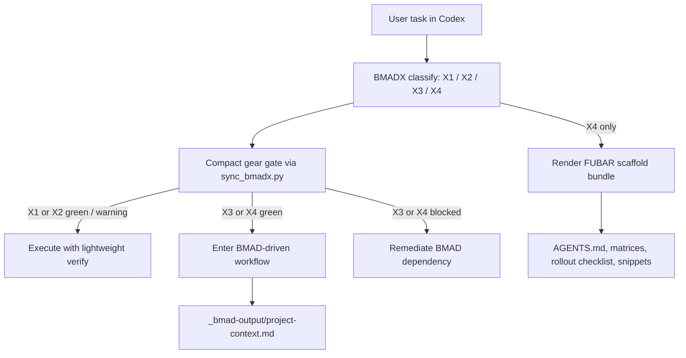

# BMADX

[](https://github.com/pdurlej/BMADX/releases/tag/v0.2.2)
[](LICENSE)
[](docs/getting-started.md)
[](#dependency-on-bmad)
[](docs/index.md)

BMADX is a `BMAD-first` tactical overlay for Codex.

It is a deliberately lazy solution for vibe-coding challenges: less manual than
raw `BMAD`, much lighter than `OMX`, but still opinionated about routing,
verification, and escalation when the work stops being trivial.


Core idea:
- `BMAD` remains the process system and source of truth,
- `BMADX` adds an operational layer for Codex,
- `OMX` is a source of selected inspiration, not the runtime target.

Non-negotiable rule:
- `BMAD > BMADX`

This repository currently tracks `BMADX v0.2.2`.

## Why this exists

BMADX exists for a very specific gap:
- you do not want to manually decide every time whether a task should be a tiny one-shot, a regular local change, a full BMAD flow, or a full escalation,
- you do not want the weight of a full orchestration runtime,
- you still want `verify-before-done`,
- you want a stronger fallback mode for messy projects without paying that cost on every task.

In short:
- `BMAD` is best when you are already working natively inside BMAD,
- `OMX` is strong as a heavier Codex workflow layer,
- `BMADX` sits in the middle: less ceremony, simpler routing, and a scaffold bundle only when needed.

## What BMADX is and is not

BMADX is:
- a gear-based routing layer for Codex: `X1`, `X2`, `X3`, `X4`,
- a verification and escalation discipline on top of BMAD,
- an `X4/FUBAR` bundle generator for chaotic or high-entropy projects,
- a benchmarked attempt to stay practical for real coding sessions.

BMADX is not:
- a replacement for BMAD,
- a second process source of truth,
- a port of the `.omx` runtime,
- a claim that BMADX beats BMAD at being BMAD.

## Dependency on BMAD

BMADX is not a standalone process system. It depends on
[`bmad-method-codex`](skill/bmadx/references/skill-manifest.json), which is
used by the dependency gate and treated as the upstream owner of process
artifacts and workflow semantics.

That means:
- BMAD owns phases, workflow maps, and process artifacts,
- BMADX owns task routing, operational discipline, verification gates, and the
  `X4/FUBAR` scaffold bundle,
- BMADX must never become a second plan store over BMAD.

## Thanks to OMX

Thanks to `OMX` for the inspiration.

BMADX borrows a few ideas that were worth keeping:
- simple routing into a small number of work modes,
- verify discipline,
- capability-based subagent usage,
- a bias toward practical orchestration instead of pretty theory.

What BMADX does not do is port `.omx`, the team runtime, or the full OMX
ecosystem into this project.

## Public status

Current public state:
- `v0.2.2` ships the shorter `X1/X2` response contract,
- the skill uses `classify first, gate second`,
- `X1/X2` use a compact fast path,
- `X3/X4` keep a BMAD-first hard execution gate,
- the benchmark runner now tracks mixed metrics, not just tokens.

This is a real working repo, not just a concept note:
- the skill lives in [`skill/bmadx`](skill/bmadx),
- the benchmark runner lives in
  [`benchmark/scripts/run_bmadx_benchmark.py`](benchmark/scripts/run_bmadx_benchmark.py),
- the installer lives in [`scripts/install_bmadx.py`](scripts/install_bmadx.py),
- benchmark artifacts are committed,
- a sample `X4/FUBAR` bundle is included in
  [`samples/fubar-bundle`](samples/fubar-bundle).

## Repo layout

- [`AGENTS.md`](AGENTS.md) - working contract for the repo
- [`LICENSE`](LICENSE) - MIT license
- [`CHANGELOG.md`](CHANGELOG.md) - lightweight release surface
- [`CONTRIBUTING.md`](CONTRIBUTING.md) - contribution rules and verify steps
- [`skill/bmadx`](skill/bmadx) - current `BMADX v0.2.2` skill snapshot
- [`scripts/install_bmadx.py`](scripts/install_bmadx.py) - installer for the BMADX skill
- [`benchmark/raw`](benchmark/raw) - raw benchmark outputs
- [`benchmark/scenarios`](benchmark/scenarios) - `X1..X4` and boundary scenarios
- [`benchmark/summary-2026-04-04.json`](benchmark/summary-2026-04-04.json) - historical `BMAD vs BMADX vs OMX` comparison
- [`benchmark/summary-2026-04-05-healthy-bmad.json`](benchmark/summary-2026-04-05-healthy-bmad.json) - `healthy` rerun after `v0.2.2`
- [`benchmark/summary-2026-04-05-degraded-bmad.json`](benchmark/summary-2026-04-05-degraded-bmad.json) - `degraded` rerun after `v0.2.2`
- [`docs/index.md`](docs/index.md) - English docs index
- [`docs/getting-started.md`](docs/getting-started.md) - install and first-use guide
- [`docs/architecture.md`](docs/architecture.md) - architecture and boundaries
- [`docs/benchmark-overview.md`](docs/benchmark-overview.md) - public benchmark reading guide
- [`docs/roadmap.md`](docs/roadmap.md) - lightweight public roadmap
- [`docs/benchmark-summary-2026-04-04.md`](docs/benchmark-summary-2026-04-04.md) - historical benchmark interpretation
- [`docs/benchmark-summary-2026-04-05.md`](docs/benchmark-summary-2026-04-05.md) - mixed-metric summary for `v0.2.2`
- [`_bmad-output/project-context.md`](_bmad-output/project-context.md) - active BMAD-side technical memory for the current program

Note:
- some historical working docs are still in Polish,
- the public onboarding path is now in English through
  [`docs/index.md`](docs/index.md),
- the README, installer, architecture doc, benchmark overview, changelog, and
  contributing guide are the recommended public entry points.

## Quick start

Install from this repo:

```bash
git clone https://github.com/pdurlej/BMADX.git
cd BMADX
python3 scripts/install_bmadx.py --force
```

The installer:
- checks that `bmad-method-codex` is present,
- copies `skill/bmadx` into `~/.codex/skills/bmadx`,
- refuses to install if BMAD is missing.

Then verify:

```bash
python3 ~/.codex/skills/bmadx/scripts/sync_bmadx.py sync --json
python3 ~/.codex/skills/bmadx/scripts/test_sync_bmadx.py
python3 scripts/test_install_bmadx.py
```

For a compact gate check after classification:

```bash
python3 ~/.codex/skills/bmadx/scripts/sync_bmadx.py check --gear X1 --compact
python3 ~/.codex/skills/bmadx/scripts/sync_bmadx.py check --gear X2 --compact
python3 ~/.codex/skills/bmadx/scripts/sync_bmadx.py check --gear X3 --compact
python3 ~/.codex/skills/bmadx/scripts/sync_bmadx.py check --gear X4 --compact
```

To render the `X4/FUBAR` scaffold bundle:

```bash
python3 ~/.codex/skills/bmadx/scripts/render_fubar_bundle.py \
  --project-name "Your project" \
  --project-path "$PWD" \
  --output-dir /tmp/bmadx-fubar
```

More detail:
- [Getting Started](docs/getting-started.md)
- [Install for Vibe Coders](docs/install-for-vibe-coders.md)

## Install in Codex for vibe coders

If you just want BMADX in your own Codex without reading the whole repo first:

```bash
git clone https://github.com/pdurlej/BMADX.git
cd BMADX
python3 scripts/install_bmadx.py --force
python3 ~/.codex/skills/bmadx/scripts/sync_bmadx.py sync --json
```

If you prefer to let Codex do it for you, give it this repo URL:

```text
https://github.com/pdurlej/BMADX
```

Then say:

```text
Install BMADX from this repository into my Codex skills.
First verify that ~/.codex/skills/bmad-method-codex exists.
If BMAD is missing, stop and tell me to install it first.
If it exists, clone the repo, run `python3 scripts/install_bmadx.py --force`,
then verify with `python3 ~/.codex/skills/bmadx/scripts/sync_bmadx.py sync --json`
and `python3 ~/.codex/skills/bmadx/scripts/test_sync_bmadx.py`.
```

## Architecture



More detail:
- [Architecture](docs/architecture.md)

## The gear model

- `X1` - one-shot
- `X2` - regular local change
- `X3` - complex BMAD flow
- `X4` - FUBAR / BMAD+

Practical rule of thumb:
- use `X1` for tiny local changes,
- use `X2` for bounded multi-file work with a short plan,
- use `X3` when BMAD artifacts and phases should drive execution,
- use `X4` when the project is messy enough to justify BMAD plus a scaffold
  bundle and explicit ownership structure.

`X4` is meant to be the ace in the sleeve, not the default mode.

## Benchmark snapshot

Historical baseline from
[`benchmark/summary-2026-04-04.json`](benchmark/summary-2026-04-04.json):
- `BMAD`: average `7237.5` tokens
- `BMADX`: average `10954.75` tokens
- `OMX`: average `25540.5` tokens

Current `v0.2.2` reruns:
- `BMADX healthy`: average `8290.5` tokens
- `BMADX degraded`: average `7052.75` tokens

Latest mixed-metric summary:
- [`docs/benchmark-summary-2026-04-05.md`](docs/benchmark-summary-2026-04-05.md)
- [`docs/benchmark-overview.md`](docs/benchmark-overview.md)

## Where BMADX looks better than OMX

From the benchmarked runs:

| Area | `BMADX` | `OMX` | Read it as |
| --- | --- | --- | --- |
| historical average across `X1..X4` | `10954.75` | `25540.5` | `BMADX` is lower-cost by `14585.75` tokens, roughly `57.1%` |
| `v0.2.2` healthy core average | `8290.5` | historical OMX baseline `25540.5` | `BMADX` is lower-cost by `17250.0` tokens, roughly `67.5%` |
| runtime weight | light overlay on top of BMAD | heavier `.omx` runtime | BMADX is easier to justify for pragmatic, low-friction Codex sessions |

Practical conclusion:
- if you want lightweight routing, verify discipline, and no full orchestration
  runtime, BMADX presents well against OMX,
- OMX remains a serious reference point, but not the target runtime for this repo.

## Where BMAD still wins, and where BMADX adds value

This repo should be read honestly:
- BMADX is not trying to prove it beats BMAD everywhere,
- BMADX is trying to make BMAD easier to operate inside Codex.

| Area | `BMAD` | `BMADX` | Honest reading |
| --- | --- | --- | --- |
| historical average across `X1..X4` | `7237.5` | `10954.75` | BMAD wins on raw token cost |
| `X1` tiny task | `4179` | `8630` in `v0.2.2 healthy` | BMAD is cheaper; BMADX adds automatic gear choice |
| `X2` regular bounded change | `5686` | `8770` in `v0.2.2 healthy` | BMAD is cheaper; BMADX reduces process-selection friction |
| `X3` story/process-first | `11044` | `5385` in `v0.2.2 healthy` | this sample favored BMADX on tokens, but semantically BMAD still owns this territory |
| `X4` chaos plus scaffold | `8041` | `10377` in `v0.2.2 healthy` | BMAD is cheaper; BMADX adds the bundle and the tactical overlay |

Practical conclusion:
- if you are already fully native to BMAD, BMAD is often the cleaner answer,
- if you want BMAD to stay upstream but need lighter in-session routing, BMADX
  becomes useful,
- BMADX is strongest in `X2` and `X4`, not because it beats BMAD on every token
  metric, but because it reduces operator friction and adds bundle generation.

## Honest reading of the benchmark

The benchmark is useful, but it is not perfectly symmetric:
- the `BMAD` and `OMX` comparison numbers come from the historical
  `2026-04-04` run,
- the `BMADX v0.2.2` numbers come from `2026-04-05` reruns,
- the repo explicitly keeps `healthy` and `degraded` profiles separate,
- the newer runner validates formatting, routing, and reference-read budget in
  addition to tokens.

So the right reading is:
- BMADX clearly beats OMX on operational weight and measured cost in these runs,
- BMAD still beats BMADX as the native process system in many cases,
- BMADX is valuable precisely because it does not try to replace BMAD.

## Why this may appeal to vibe coders

BMADX is intentionally built for people who want to stay productive without
turning every task into a process ceremony.

That means:
- you can be lazy about route selection without being sloppy about verification,
- you can stay lightweight on `X1/X2`,
- you can escalate into real BMAD when the work actually needs it,
- you can pull out `X4/FUBAR` only when the project is messy enough to deserve it.

That is the pitch:
- less friction than `OMX`,
- less manual process choice than raw `BMAD`,
- more discipline than ad hoc one-shot prompting.

## Fast onboarding for a new Codex thread

1. Read [`AGENTS.md`](AGENTS.md).
2. Read [`docs/getting-started.md`](docs/getting-started.md).
3. Read [`docs/benchmark-overview.md`](docs/benchmark-overview.md).
4. Work in [`skill/bmadx`](skill/bmadx).

## Current best use cases

| Situation | Best fit | Why |
| --- | --- | --- |
| `X1` tiny local task | `BMAD` or `BMADX v0.2.2` | both stay relatively light; BMADX adds automatic routing |
| `X2` bounded multi-file change | `BMADX` | lighter operator burden than raw BMAD, much lighter than OMX |
| `X3` process-first implementation | `BMAD` | this is BMAD-native territory |
| `X4` messy project with rollout/ownership needs | `BMADX` | BMADX adds a scaffold bundle on top of BMAD |

## Public repo support surfaces

If you want to use, evaluate, or extend the project, start here:
- [`docs/index.md`](docs/index.md)
- [`docs/getting-started.md`](docs/getting-started.md)
- [`docs/install-for-vibe-coders.md`](docs/install-for-vibe-coders.md)
- [`docs/architecture.md`](docs/architecture.md)
- [`docs/benchmark-overview.md`](docs/benchmark-overview.md)
- [`CHANGELOG.md`](CHANGELOG.md)
- [`CONTRIBUTING.md`](CONTRIBUTING.md)

The repo is still intentionally lean, but it now has the minimum public surfaces
needed to be useful to someone outside the original working thread.
