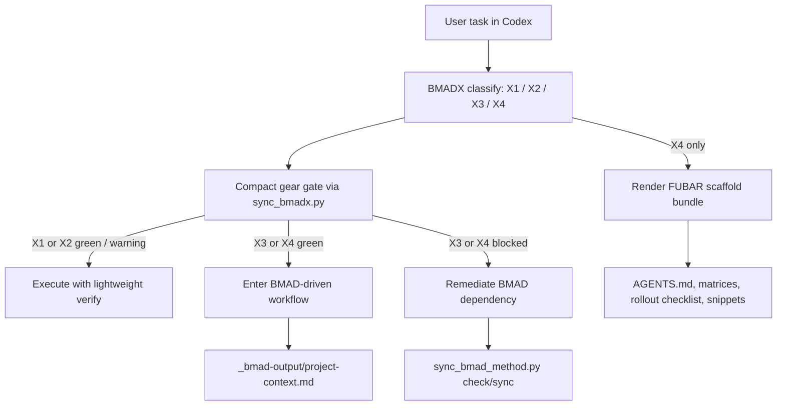

# BMADX Architecture

BMADX is intentionally small.

It does not try to replace BMAD. It sits between a Codex task and the decision
about how much process, verification, and scaffolding the task actually needs.

## Mental model

- `BMAD` owns the process model
- `BMADX` owns task routing and operational discipline
- Codex remains the execution engine

## High-level diagram

## Component boundaries

### 1. BMAD upstream dependency

BMADX depends on `bmad-method-codex`.

That dependency provides:
- BMAD sync and drift detection
- access to the BMAD-side workflow vocabulary
- the upstream source of truth for process semantics

BMADX should never become a competing source of process truth.

### 2. Gear classifier

BMADX classifies work into four gears:
- `X1` for tiny one-shots
- `X2` for bounded regular work
- `X3` for BMAD-native complex work
- `X4` for FUBAR / BMAD+ escalation

The classifier is intentionally practical rather than academic.

### 3. Compact gate

After classification, BMADX runs a gear-aware compact gate.

Important behavior:
- `X1/X2` use the fast path
- `X1/X2` can continue with a soft warning if BMAD is not freshly healthy
- `X3/X4` keep a hard execution gate
- classification is separate from execution permission

This split is one of the key design decisions in `v0.2+`.

### 4. Execution discipline

BMADX enforces `verify-before-done` at every gear, but the amount of ceremony
changes by gear:
- `X1` stays minimal
- `X2` gets a short plan and short verify block
- `X3/X4` align with BMAD artifacts and criteria

### 5. `X4/FUBAR` bundle

`X4` is not the default mode.

It exists for cases where BMAD alone is not enough as a tactical operating
surface inside Codex, especially when the project needs:
- explicit ownership
- rollout structure
- trigger and verify matrices
- reusable repo scaffolding

The bundle is an overlay on BMAD, not a replacement for BMAD.

## Design constraints

BMADX is intentionally constrained by these rules:
- `BMAD > BMADX`
- BMADX must stay lighter than OMX
- BMADX should be useful to vibe coders without becoming sloppy
- `X4` must stay rare and valuable, not the default

## What this architecture is optimized for

This repo is optimized for:
- lower operator friction in Codex
- explicit routing between different task shapes
- keeping BMAD upstream while making day-to-day usage easier
- a benchmarkable, inspectable public artifact

It is not optimized for:
- being a universal runtime layer
- replacing BMAD
- matching OMX feature-for-feature
